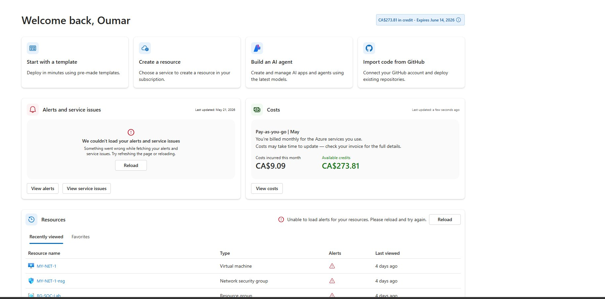
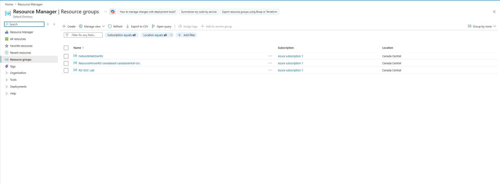
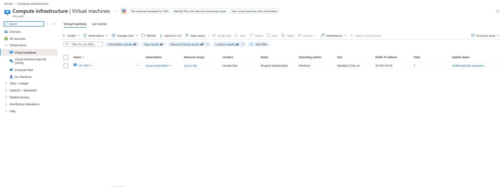
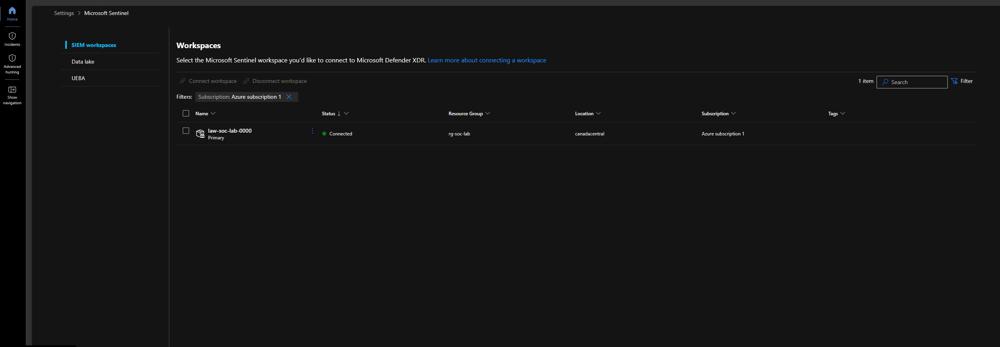
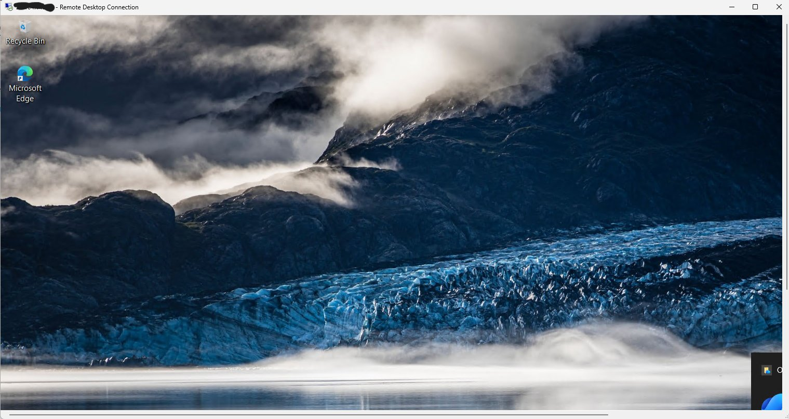
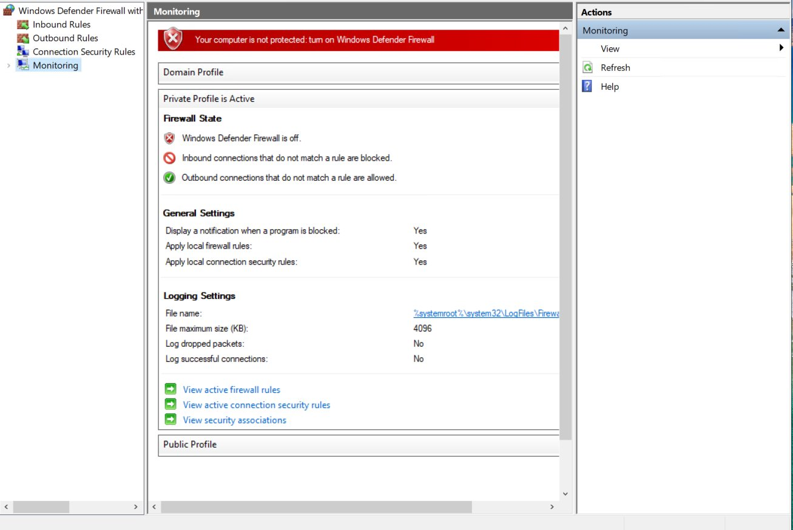
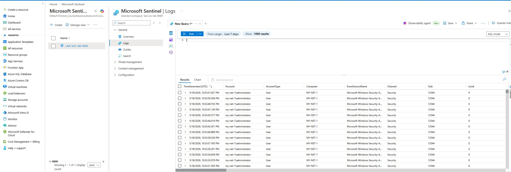
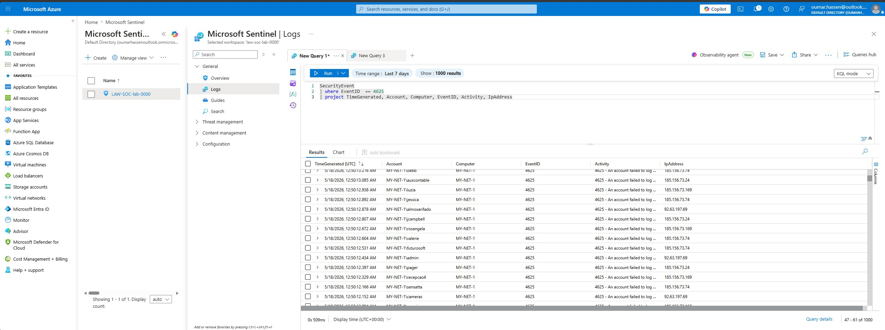
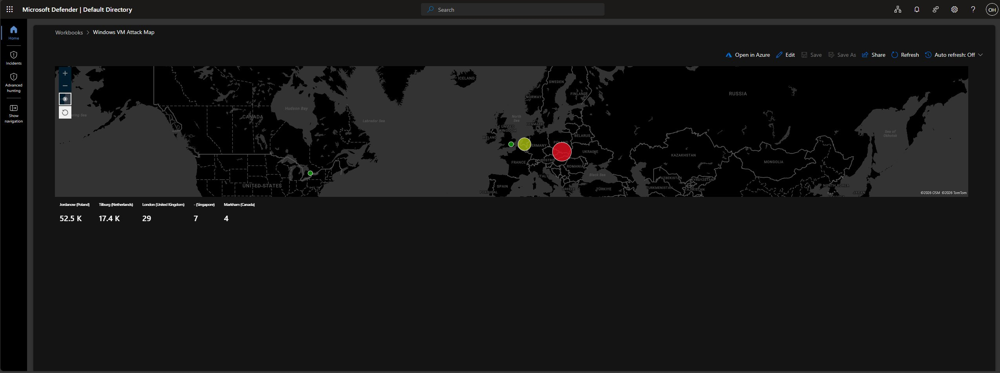
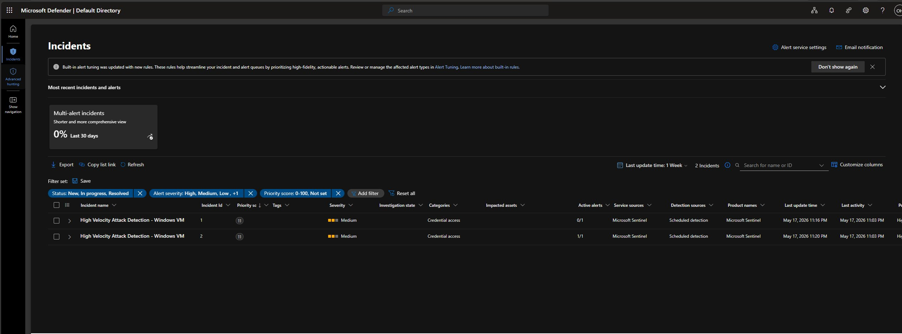

# 🛡️ Azure SOC Home Lab — Microsoft Sentinel + Honeypot Attack Map

> **Project Type:** Cybersecurity Home Lab  
> **Platform:** Microsoft Azure  
> **Tools Used:** Microsoft Sentinel (SIEM), Log Analytics Workspace, Windows 10 VM, PowerShell, KQL  
> **Inspired by:** [Josh Madakor's YouTube Tutorial](https://youtu.be/g5JL2RIbThM)

---

## 📌 Project Overview

In this project, I built a **cloud-based Security Operations Center (SOC)** using Microsoft Azure. A Windows virtual machine was intentionally exposed to the internet as a **honeypot** — designed to attract real-world attackers attempting brute-force RDP logins.

All failed login events (Event ID 4625) were captured, forwarded to a **Log Analytics Workspace**, and visualized in **Microsoft Sentinel** as a live **world attack map**. Sentinel also automatically generated **incidents** based on high-velocity attack detection rules — mimicking a real enterprise SOC workflow.

This lab demonstrates hands-on experience with:
- Azure resource provisioning (VMs, NSGs, Resource Groups)
- SIEM configuration and log ingestion (Microsoft Sentinel)
- KQL (Kusto Query Language) for log querying and parsing
- Real-world threat detection and automated incident management
- Threat visualization via custom workbooks and attack maps

---

## 🗺️ Architecture Diagram

```
Internet Attackers (Poland, Netherlands, UK, Singapore...)
       │
       ▼ (RDP Brute Force — Port 3389)
┌─────────────────────────┐
│  Windows VM             │  ← Honeypot (Firewall OFF, NSG allows all inbound)
│  (MY-NET-1)             │
│  Event Viewer → 4625    │  ← Captures failed RDP logon events
│  PowerShell Script      │  ← Queries ipgeolocation.io API per attacker IP
│  failed_rdp.log         │  ← Geo-enriched custom log file
└────────────┬────────────┘
             │
             ▼
┌─────────────────────────┐
│  Log Analytics Workspace│  ← Ingests Windows Security Events + custom log
│  (law-soc-lab-0000)     │
└────────────┬────────────┘
             │
             ▼
┌─────────────────────────┐
│  Microsoft Sentinel     │  ← SIEM: KQL queries, Workbook Attack Map, Incidents
│  (rg-soc-lab)           │
└─────────────────────────┘
```

---

## 🧰 Prerequisites

| Requirement | Details |
|---|---|
| Azure Account | Free account with $200 credit — [azure.microsoft.com/free](https://azure.microsoft.com/en-us/free/) |
| ipgeolocation.io API Key | Free tier: 1,000 API calls/day — [ipgeolocation.io](https://ipgeolocation.io/) |
| PowerShell Script | Josh Madakor's log exporter — [GitHub link](https://github.com/joshmadakor1/Sentinel-Lab/blob/main/Custom_Security_Log_Exporter.ps1) |
| RDP Client | Built into Windows; use Microsoft Remote Desktop on macOS |

---

## 🚀 Step-by-Step Setup

---

### STEP 1 — Create a Free Azure Account

1. Navigate to [https://azure.microsoft.com/en-us/free/](https://azure.microsoft.com/en-us/free/)
2. Sign in with a Microsoft account or create one
3. Provide a valid credit/debit card (you will **not** be charged automatically)
4. Confirm you receive **$200 in free credits**
5. You will land on the Azure Portal dashboard

> ⚠️ **Important:** Set up a **spending budget alert** immediately.  
> Go to: `Cost Management + Billing` → `Cost Management` → `Budgets` → Create a budget with a low threshold so you receive email alerts before being charged.


*Azure Portal home dashboard showing CA$273.81 in available credits and recently accessed SOC lab resources including the VM, NSG, and Resource Group*

---

### STEP 2 — Create a Resource Group

A resource group is a logical container for all related Azure resources in this lab.

1. In the Azure portal search bar, type **"Resource groups"** and select it
2. Click **+ Create**
3. Fill in the details:
   - **Subscription:** Your active subscription
   - **Resource group name:** `RG-SOC-Lab`
   - **Region:** Canada Central (or closest to you)
4. Click **Review + Create** → **Create**


*Resource groups page showing RG-SOC-Lab successfully created in Canada Central under Azure Subscription 1*

---

### STEP 3 — Create the Honeypot Virtual Machine

1. Search for **"Virtual machines"** in the Azure portal and click **+ Create**
2. Configure the **Basics** tab:
   - **Resource group:** `RG-SOC-Lab`
   - **VM name:** `MY-NET-1`
   - **Region:** Canada East
   - **Image:** Windows 10 Pro
   - **Size:** Standard_D2as_v4
   - **Username/Password:** Create strong credentials *(save these for RDP login)*
   - **Public inbound ports:** Allow RDP (3389)

3. Navigate to the **Networking** tab:
   - Under **NIC network security group**, select **Advanced**
   - Click **Create new** for the Network Security Group
   - **Delete** the default inbound rule (`1000: default-allow-rdp`)
   - Click **+ Add an inbound rule** and configure:
     - **Destination port ranges:** `*` (all ports)
     - **Protocol:** Any
     - **Action:** Allow
     - **Priority:** `100`
     - **Name:** `DANGER_AllowAnyCustomAnyInbound`
   - This makes the VM reachable from the entire internet

4. Click **Review + Create** → **Create** and wait for deployment


*Virtual machines page showing MY-NET-1 deployed in Canada East under resource group rg-soc-lab, running Windows OS on Standard_D2as_v4*

---

### STEP 4 — Create a Log Analytics Workspace

The Log Analytics Workspace collects and stores all logs from the VM for querying in Sentinel.

1. Search for **"Log Analytics workspaces"** in the portal and click **+ Create**
2. Configure:
   - **Resource group:** `RG-SOC-Lab`
   - **Name:** `law-soc-lab-0000`
   - **Region:** Same region as the VM
3. Click **Review + Create** → **Create**

---

### STEP 5 — Enable Microsoft Defender for Cloud

1. Search for **"Microsoft Defender for Cloud"**
2. Go to **Environment settings** in the left panel
3. Expand your subscription and click on `law-soc-lab-0000`
4. Set **Servers** to **ON**
5. Set **SQL servers on machines** to **OFF**
6. Go to **Data Collection** tab → select **All Events**
7. Click **Save**

---

### STEP 6 — Connect the VM to the Log Analytics Workspace

1. Navigate to **Log Analytics workspaces** → `law-soc-lab-0000`
2. In the left panel, click **Virtual machines**
3. Find `MY-NET-1` → click it → click **Connect**
4. Wait for the status to show **Connected**

---

### STEP 7 — Set Up Microsoft Sentinel

1. Search for **"Microsoft Sentinel"** in the portal
2. Click **+ Create**
3. Select the Log Analytics Workspace: `law-soc-lab-0000`
4. Click **Add** and wait for initialization


*Microsoft Sentinel SIEM Workspaces page showing law-soc-lab-0000 with status 🟢 Connected, under resource group rg-soc-lab in Canada Central*

---

### STEP 8 — RDP Into the VM & Disable Windows Firewall

1. Copy the VM's **Public IP address** from the Azure portal
2. Open **Remote Desktop Connection** on your local machine
3. Enter the VM's public IP and log in with your admin credentials
4. Once inside the VM, open **Start** → search `wf.msc` → press Enter
5. Click **Windows Defender Firewall Properties**
6. For **Domain**, **Private**, and **Public** profiles — set **Firewall state** to **Off**
7. Click **Apply** → **OK**

> This ensures the VM responds to all incoming traffic, making it easily discoverable by attackers worldwide.


*Successful RDP session into the honeypot VM — Windows 10 desktop visible inside the Remote Desktop Connection window, confirming remote access is working*


*Windows Defender Firewall (wf.msc) showing Firewall State OFF across all profiles — the red warning banner confirms the VM is fully unprotected and exposed to the internet*

---

### STEP 9 — Run the PowerShell Log Exporter Script

This script continuously monitors Windows Event Viewer for **Event ID 4625** (failed RDP logon attempts), calls the ipgeolocation.io API to enrich each attacker's IP with location data, and writes everything to a custom log file at `C:\ProgramData\failed_rdp.log`.

**On the VM, open PowerShell ISE as Administrator and run the following script:**

```powershell
# Get API key from here: https://ipgeolocation.io/
$API_KEY      = "YOUR_API_KEY_HERE"
$LOGFILE_NAME = "failed_rdp.log"
$LOGFILE_PATH = "C:\ProgramData\$($LOGFILE_NAME)"

# XML filter to capture only failed logon events (Event ID 4625) from Event Viewer
$XMLFilter = @'
<QueryList> 
   <Query Id="0" Path="Security">
         <Select Path="Security">
              *[System[(EventID='4625')]]
          </Select>
    </Query>
</QueryList> 
'@

# Write sample log entries to train Log Analytics custom field extraction
Function write-Sample-Log() {
    "latitude:47.91542,longitude:-120.60306,destinationhost:samplehost,username:fakeuser,sourcehost:24.16.97.222,state:Washington,country:United States,label:United States - 24.16.97.222,timestamp:2021-10-26 03:28:29" | Out-File $LOGFILE_PATH -Append -Encoding utf8
    "latitude:52.37022,longitude:4.89517,destinationhost:samplehost,username:CSNYDER,sourcehost:89.248.165.74,state:North Holland,country:Netherlands,label:Netherlands - 89.248.165.74,timestamp:2021-10-26 06:12:56" | Out-File $LOGFILE_PATH -Append -Encoding utf8
}

# Create log file if it doesn't exist
if ((Test-Path $LOGFILE_PATH) -eq $false) {
    New-Item -ItemType File -Path $LOGFILE_PATH
    write-Sample-Log
}

# Infinite loop — continuously checks Event Viewer for new failed logon attempts
while ($true) {
    Start-Sleep -Seconds 1
    $events = Get-WinEvent -FilterXml $XMLFilter -ErrorAction SilentlyContinue

    foreach ($event in $events) {
        if ($event.properties[19].Value.Length -ge 5) {

            $timestamp   = "$($event.TimeCreated.Year)-$($event.TimeCreated.Month)-$($event.TimeCreated.Day) $($event.TimeCreated.Hour):$($event.TimeCreated.Minute):$($event.TimeCreated.Second)"
            $sourceIp    = $event.properties[19].Value
            $username    = $event.properties[5].Value
            $destination = $event.MachineName

            $log_contents = Get-Content -Path $LOGFILE_PATH

            if (-Not ($log_contents -match "$($timestamp)") -or ($log_contents.Length -eq 0)) {
                Start-Sleep -Seconds 1

                # Call geolocation API with attacker's IP
                $API_ENDPOINT = "https://api.ipgeolocation.io/ipgeo?apiKey=$($API_KEY)&ip=$($sourceIp)"
                $response     = Invoke-WebRequest -UseBasicParsing -Uri $API_ENDPOINT
                $responseData = $response.Content | ConvertFrom-Json

                $latitude   = $responseData.latitude
                $longitude  = $responseData.longitude
                $state_prov = if ($responseData.state_prov -eq "") { "null" } else { $responseData.state_prov }
                $country    = $responseData.country_name

                # Write enriched log entry
                "latitude:$($latitude),longitude:$($longitude),destinationhost:$($destination),username:$($username),sourcehost:$($sourceIp),state:$($state_prov),country:$($country),label:$($country) - $($sourceIp),timestamp:$($timestamp)" | Out-File $LOGFILE_PATH -Append -Encoding utf8

                # Display in purple/magenta in the console
                Write-Host -BackgroundColor Black -ForegroundColor Magenta "latitude:$($latitude),longitude:$($longitude),destinationhost:$($destination),username:$($username),sourcehost:$($sourceIp),state:$($state_prov),label:$($country) - $($sourceIp),timestamp:$($timestamp)"
            }
        }
    }
}
```

> ⚠️ **Security Note:** Use a throwaway account for ipgeolocation.io — **never enter personal credentials inside an exposed honeypot VM.**  
> The script runs in an infinite loop. Leave it running to continuously collect attack data. Output appears as purple/magenta text in the console for each detected attack.

---

### STEP 10 — Create a Custom Log in Log Analytics Workspace

1. Go to **Log Analytics workspaces** → `law-soc-lab-0000`
2. Click **Tables** → **Create** → **New custom log (MMA-based)**
3. Copy the contents of `C:\ProgramData\failed_rdp.log` from the VM to your local machine and save as a `.log` file
4. Upload it as the sample log
5. Set collection path: **Windows** → `C:\ProgramData\failed_rdp.log`
6. Name it: `FAILED_RDP_WITH_GEO` (Azure automatically appends `_CL`)
7. Click **Create**

> ⏳ Allow 15–30 minutes for logs to begin appearing in Azure.

---

### STEP 11 — Query Logs with KQL

Navigate to **Microsoft Sentinel** → `law-soc-lab-0000` → **Logs** and run queries to analyze the attack data.

**Query 1 — View all failed RDP logon events (Event ID 4625):**
```kql
SecurityEvent
| where EventID == 4625
| project TimeGenerated, Account, Computer, EventID, Activity, IpAddress
```

**Query 2 — Parse and summarize geolocation data for the attack map:**
```kql
FAILED_RDP_WITH_GEO_CL
| extend 
    username    = extract(@"username:([^,]+)", 1, RawData),
    latitude    = extract(@"latitude:([^,]+)", 1, RawData),
    longitude   = extract(@"longitude:([^,]+)", 1, RawData),
    sourcehost  = extract(@"sourcehost:([^,]+)", 1, RawData),
    country     = extract(@"country:([^,]+)", 1, RawData),
    label       = extract(@"label:([^,]+)", 1, RawData),
    destination = extract(@"destinationhost:([^,]+)", 1, RawData)
| where destination != "samplehost"
| where sourcehost != ""
| summarize event_count=count() by sourcehost, latitude, longitude, country, label, destination
```


*Microsoft Sentinel Logs showing live Windows Security Audit events streaming from MY-NET-1 in real time — confirming successful log ingestion into the workspace*


*KQL query filtering for Event ID 4625 (An account failed to log on) — results show attacker IP 45.142.193.145 hammering the administrator account on MY-NET-1 every few seconds on May 18, 2026, confirming active brute-force RDP attacks*

---

### STEP 12 — Create the Attack Map Workbook in Microsoft Sentinel

1. Go to **Microsoft Sentinel** → **Workbooks** → **+ Add workbook**
2. Click **Edit** → remove all default widgets
3. Click **+ Add** → **Add query**
4. Paste the geolocation KQL query from Step 11
5. Run the query → set **Visualization** to **Map**
6. Configure **Map Settings:**
   - Location info using: **Latitude/Longitude**
   - Latitude field: `latitude`
   - Longitude field: `longitude`
   - Size by: `event_count`
   - Metric label: `label`
7. Click **Apply** → **Done Editing** → **Save**
8. Name it: `Windows VM Attack Map`
9. Keep refreshing to watch new attacks appear in real time


*Microsoft Sentinel Workbook — Windows VM Attack Map displaying real-world brute force RDP attacks from across the globe. Over **70,000 total attack attempts** were captured: Jordanów Poland (52.5K), Tilburg Netherlands (17.4K), London UK (29), Singapore (7), and Markham Canada (4)*

---

## 🚨 Incidents & Automated Threat Detection

One of the most powerful aspects of this lab was watching Microsoft Sentinel **automatically detect and generate incidents** based on the high velocity of failed authentication attempts — no manual intervention required.


*Microsoft Sentinel Incidents page showing 2 automatically triggered incidents: "High Velocity Attack Detection - Windows VM" (Incident 1 & 2), classified as **Medium severity** under the **Credential Access** category, detected by Sentinel's scheduled detection rules on May 17, 2026 — demonstrating automated SOC alerting in action*

---

## 📊 Results & Findings

| Metric | Result |
|---|---|
| **Total attack attempts captured** | 70,000+ |
| **#1 Attacker location** | Jordanów, Poland — 52,500 attempts |
| **#2 Attacker location** | Tilburg, Netherlands — 17,400 attempts |
| **#3 Attacker location** | London, United Kingdom — 29 attempts |
| **#4 Attacker location** | Singapore — 7 attempts |
| **#5 Attacker location** | Markham, Canada — 4 attempts |
| **Primary username targeted** | Administrator |
| **Event ID monitored** | 4625 (An account failed to log on) |
| **Incidents auto-generated** | 2 (High Velocity Attack Detection) |
| **Incident severity** | Medium |
| **Incident category** | Credential Access |
| **Time to first attack** | Within minutes of VM going live |

---

## 🔍 Key Concepts Demonstrated

### SIEM (Security Information and Event Management)
Microsoft Sentinel aggregates log data from multiple sources, enabling centralized visibility, automated threat detection, and incident management across a cloud environment.

### Honeypot
An intentionally vulnerable system placed on the internet to observe real attacker behavior, tools, and techniques without putting production systems at risk.

### KQL (Kusto Query Language)
A powerful query language used in Azure to search, parse, and analyze log data. Used in this lab to filter Event ID 4625 logs and extract geolocation fields from raw log strings using `extract()` and `summarize`.

### Event ID 4625
A Windows Security Event generated every time a logon attempt fails. A core indicator for brute-force attack detection in SOC environments.

### Network Security Groups (NSG)
Azure's virtual firewall mechanism. The NSG was intentionally configured to allow all inbound traffic to simulate a poorly secured, internet-exposed system — attracting real attackers worldwide.

### Automated Incident Response
Microsoft Sentinel's scheduled detection rules automatically identified the high-velocity attack pattern and created actionable incidents for analyst review, mirroring real enterprise SOC workflows.

---

## 🛠️ Tools & Technologies

| Tool | Purpose |
|---|---|
| **Microsoft Azure** | Cloud platform hosting the entire lab |
| **Windows 10 VM (MY-NET-1)** | Honeypot — intentionally exposed to the internet |
| **Network Security Group (NSG)** | Configured to allow all inbound traffic |
| **Windows Event Viewer** | Source of failed logon events (Event ID 4625) |
| **PowerShell ISE** | Runs the custom log exporter script on the VM |
| **ipgeolocation.io API** | Enriches attacker IPs with latitude, longitude, and country |
| **Log Analytics Workspace** | Stores and indexes all security event log data |
| **Microsoft Sentinel** | SIEM — KQL queries, attack map workbook, automated incidents |
| **KQL** | Query language used to parse raw logs and power the attack map |

---

## ⚠️ Cleanup — Delete All Resources When Done

To avoid unexpected Azure charges after completing the lab:

1. Search for **"Resource groups"** in the Azure portal
2. Select `RG-SOC-Lab`
3. Click **Delete resource group**
4. Type `RG-SOC-Lab` to confirm deletion
5. Check **"Apply force delete for selected Virtual machines"**
6. Click **Delete**

> This removes the VM, NSG, Log Analytics Workspace, and Sentinel instance all at once.

---

## 📝 Lessons Learned

- The honeypot attracted **real attacks within minutes** of going live — a sobering demonstration of how exposed internet-facing systems truly are.
- Over **70,000 brute force attempts** were recorded, predominantly from Poland and the Netherlands, highlighting how automated and geographically widespread credential attacks are.
- **KQL parsing** is essential — raw log strings must be structured with `extract()` before they can be visualized or used for detection rules.
- Microsoft Sentinel's **automated incident detection** is powerful — it identified the high-velocity attack pattern and created actionable incidents without any manual configuration beyond the initial analytics rule.
- **Never enter personal credentials** inside an exposed honeypot VM — always use throwaway accounts for any services accessed from within the lab environment.
- Always set a **spending budget alert** in Azure before provisioning resources to avoid surprise charges.
- The **GeoIP watchlist** with 54,000+ IP-to-location mappings is what enables Sentinel to enrich raw attacker IPs into meaningful geographic data displayed on the attack map.

---

## 📚 References

- [Josh Madakor's YouTube Tutorial](https://youtu.be/g5JL2RIbThM) — Original lab inspiration
- [Josh Madakor's PowerShell Script](https://github.com/joshmadakor1/Sentinel-Lab/blob/main/Custom_Security_Log_Exporter.ps1)
- [Microsoft Sentinel Documentation](https://learn.microsoft.com/en-us/azure/sentinel/)
- [ipgeolocation.io](https://ipgeolocation.io/) — Free IP Geolocation API
- [Azure Free Account](https://azure.microsoft.com/en-us/free/)

---

*This project was completed as part of a hands-on cybersecurity home lab portfolio. All attacks observed were against an intentionally exposed honeypot in a controlled Azure environment.*
